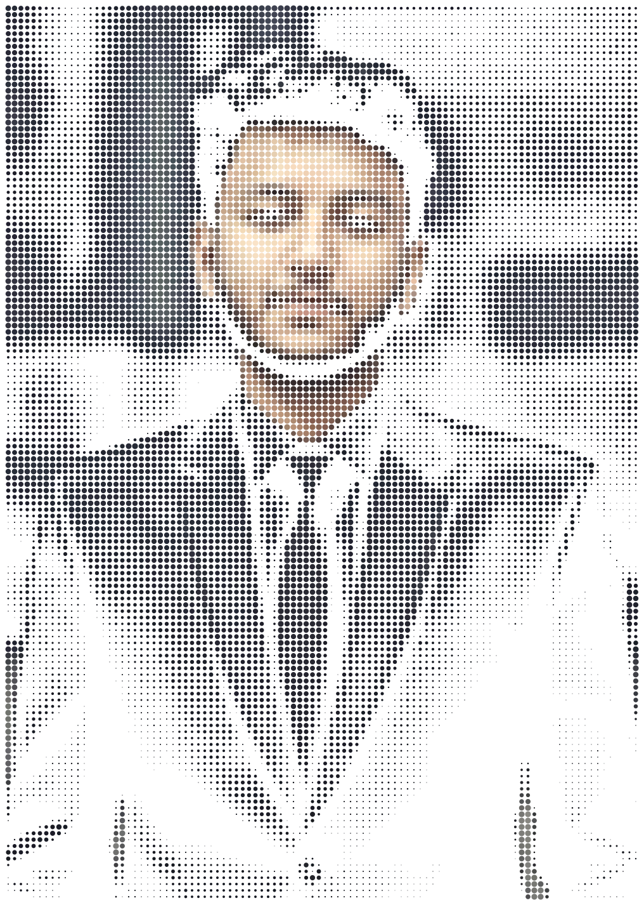
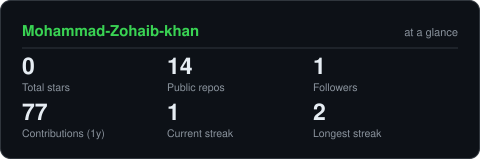
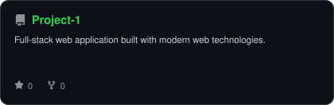
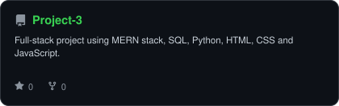
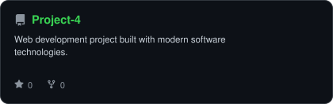

<!-- PORTRAIT - generated by scripts/dotify.py from assets/jacket.png.
     Colour mode, so one file serves both GitHub themes. Regenerate with:
       python scripts/dotify.py assets/jacket.png -o assets/portrait \
         --cols 100 --equalize --detail 0.5 --color -->

 

<!-- NAME / TAGLINE - animated typing -->

 

<!-- SOCIALS -->

---

## `~/` About

Hi, I'm **Mohammad Zohaib Khan**. I'm a software developer interested in building practical applications and improving my problem-solving skills.

- Currently building **my projects and applications**
- Exploring **MERN Stack, SQL, Python and DSA**
- Learning **software development and modern web technologies**
- Always working on **new projects and improving my skills**

 

## `~/` toolbox

---

## `~/` skill radar

<table>
<tr>
<td width="50%" align="center" valign="middle">

<!-- Self-rated radar - edit assets/skills.json, the workflow redraws it -->
<picture>
  <source media="(prefers-color-scheme: dark)"  srcset="assets/radar-dark.svg">
  <source media="(prefers-color-scheme: light)" srcset="assets/radar-light.svg">
  
</picture>

</td>
<td width="50%" align="center" valign="middle">

<!-- Live radar built from real language byte counts across your repos -->
<picture>
  <source media="(prefers-color-scheme: dark)"  srcset="assets/radar-langs-dark.svg">
  <source media="(prefers-color-scheme: light)" srcset="assets/radar-langs-light.svg">
  
</picture>

</td>
</tr>
</table>

---

## `~/` contribution calendar

<!-- Actual contribution calendar -->

  

 

<!-- 3D isometric calendar, regenerated every 6h by .github/workflows/metrics.yml -->

  

  

<!-- Snake eats the contribution graph - .github/workflows/snake.yml -->
<picture>
  <source media="(prefers-color-scheme: dark)"  srcset="https://raw.githubusercontent.com/Mohammad-Zohaib-khan/Mohammad-Zohaib-khan/output/snake-dark.svg">
  <source media="(prefers-color-scheme: light)" srcset="https://raw.githubusercontent.com/Mohammad-Zohaib-khan/Mohammad-Zohaib-khan/output/snake.svg">
  
</picture>

---

## `~/` the numbers

<!-- Generated by scripts/cards.py into this repo. Deliberately NOT
     github-readme-stats / streak-stats / github-profile-trophy: those are
     shared public instances that go down and take the whole section with them. -->
<picture>
  <source media="(prefers-color-scheme: dark)"  srcset="assets/card-stats-dark.svg">
  <source media="(prefers-color-scheme: light)" srcset="assets/card-stats-light.svg">
  
</picture>

 

  

---

## `~/` selected work

<!-- Cards generated by scripts/cards.py from assets/projects.json.
     Stars, forks and language are pulled live from the API on every run. -->
<table>
<tr>
<td width="50%">
  <a href="https://github.com/Mohammad-Zohaib-khan/Project-1">
    <picture>
      <source media="(prefers-color-scheme: dark)" srcset="assets/card-Project-1-dark.svg">
      <source media="(prefers-color-scheme: light)" srcset="assets/card-Project-1-light.svg">
      
    </picture>
  </a>
</td>
<td width="50%">
  <a href="https://github.com/Mohammad-Zohaib-khan/Project-2">
    <picture>
      <source media="(prefers-color-scheme: dark)" srcset="assets/card-Project-2-dark.svg">
      <source media="(prefers-color-scheme: light)" srcset="assets/card-Project-2-light.svg">
      
    </picture>
  </a>
</td>
</tr>
<tr>
<td width="50%">
  <a href="https://github.com/Mohammad-Zohaib-khan/Project-3">
    <picture>
      <source media="(prefers-color-scheme: dark)" srcset="assets/card-Project-3-dark.svg">
      <source media="(prefers-color-scheme: light)" srcset="assets/card-Project-3-light.svg">
      
    </picture>
  </a>
</td>
<td width="50%">
  <a href="https://github.com/Mohammad-Zohaib-khan/Project-4">
    <picture>
      <source media="(prefers-color-scheme: dark)" srcset="assets/card-Project-4-dark.svg">
      <source media="(prefers-color-scheme: light)" srcset="assets/card-Project-4-light.svg">
      
    </picture>
  </a>
</td>
</tr>
</table>

| project | live | stack |
|---|---|---|
| **[Project-1](https://github.com/Mohammad-Zohaib-khan/Project-1)** | Your Project 1 | `MERN` `SQL` `JavaScript` |
| **[Project-2](https://github.com/Mohammad-Zohaib-khan/Project-2)** | Your Project 2 | `MERN` `SQL` `Python` |
| **[Project-3](https://github.com/Mohammad-Zohaib-khan/Project-3)** | Your Project 3 | `MERN` `SQL` `Python` `JavaScript` |
| **[Project-4](https://github.com/Mohammad-Zohaib-khan/Project-4)** | Your Project 4 | `MERN` `SQL` `HTML` `CSS` |

---

`01110100 01101000 01100001 01101110 01101011 01110011 00100000 01100110 01101111 01110010 00100000 01110011 01100011 01110010 01101111 01101100 01101100 01101001 01101110 01100111`

